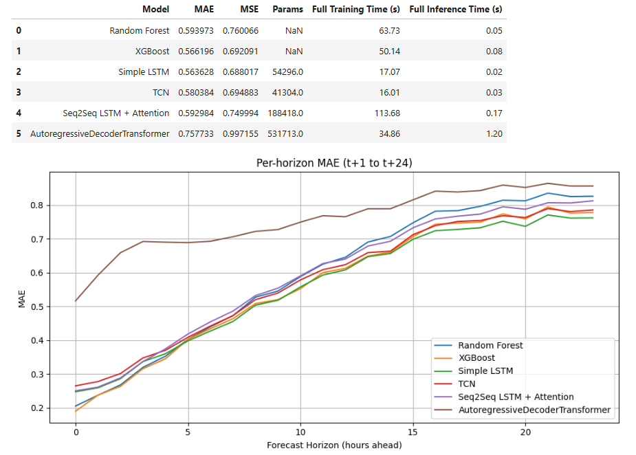
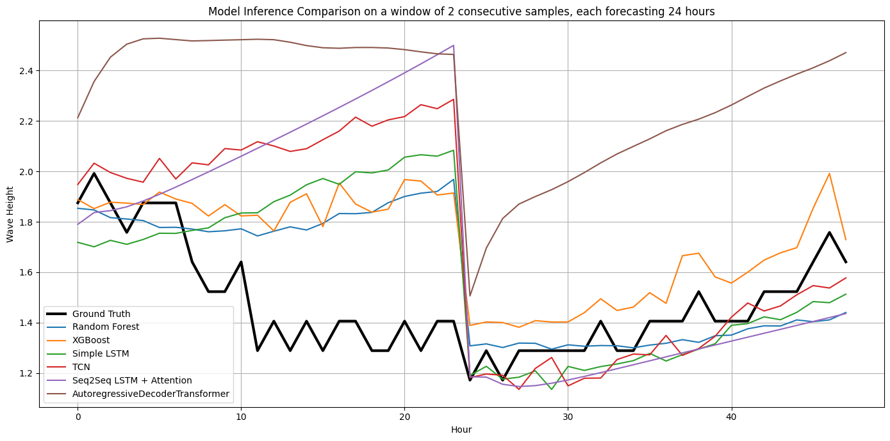

# Sea State Forecasting with Machine Learning & Deep Learning

Forecasting sea state (wave height) is critical for marine operations, coastal monitoring, and climate analysis. This project develops and compares machine learning and deep learning models to predict the next 24 hours of wave height using the previous 24 hours of all features, based on nearly two decades of hourly data.

---

## Quick Overview

| Setting         | Details                                  |
|----------------|-------------------------------------------|
| Forecast Target | `WaveHeight` (next 24 hours)             |
| Input           | Last 24 hours of all features            |
| Data Range      | 2006-09-25 to 2025-03-28 (hourly)         |
| Missing Years   | 2008, 2009 (excluded due to gaps)        |
| Imputation      | Time-based linear interpolation           |
| Models Tested   | XGBoost, Random Forest, LSTM, TCN        |
| Validation      | 2022, 2023, 2024, 2025                   |

---

## Modeling Approach

We frame the task as a multi-step direct forecast: given 24 hours of past data, predict 24 consecutive future wave height values.

### Context Window Strategy

- Overlapping context windows (stride < window size) clearly improve performance.
- Larger context windows help LSTM and TCN, but have little impact on XGBoost and RF.

---

## Model Performance Summary

*Performance comparison of models (MAE across prediction horizons).*

- XGBoost performs best on short-term horizons (first 10 hours).
- LSTM and TCN outperform in the longer term due to smoother forecasts.

---

## Output Examples

| Model      | Prediction Characteristics |
|------------|----------------------------|
| XGBoost    | Sharp, responsive, noisy   |
| LSTM/TCN   | Smoother, stable forecasts |

*Example predictions for different models. Ground truth in black.*

---

## Evaluation Strategy

- **Train/Test Split**: Training on 2006–2021, validation on 2022–2025
- **Metrics**: MAE per forecast horizon (1h to 24h), RMSE, visual plots
- **Frameworks**: PyTorch (LSTM, TCN), scikit-learn (RF), XGBoost

